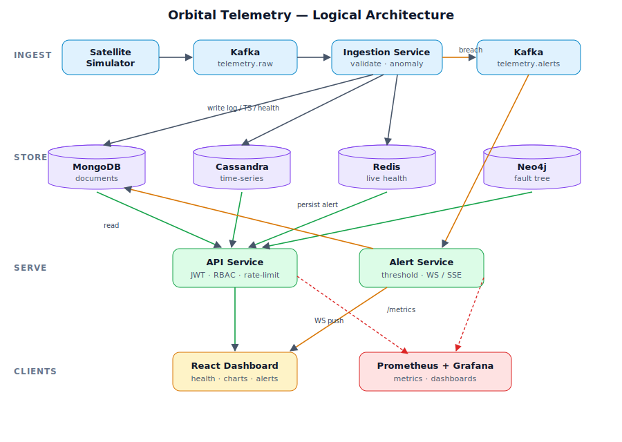
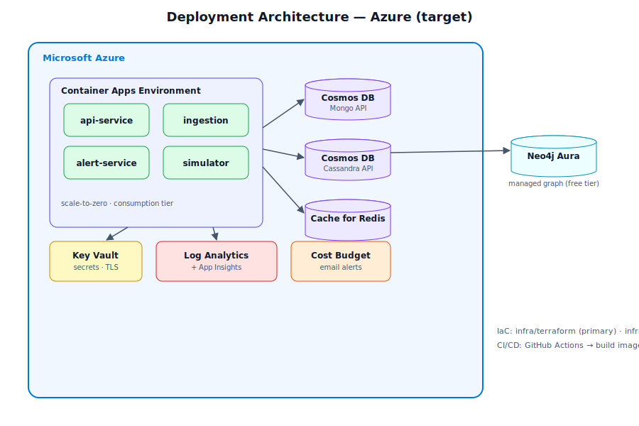
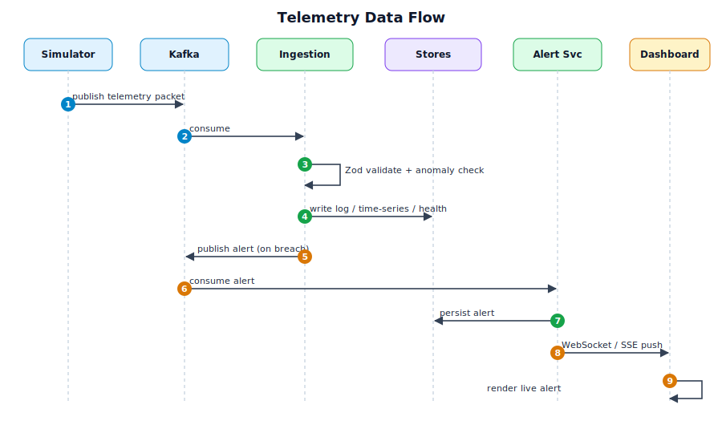

# Architecture Diagrams

Open these SVGs directly, or drop them into slides.

## Logical architecture
How telemetry flows from satellites through Kafka and the ingestion service into the four NoSQL
stores, and how the API/alert services serve clients and monitoring.

## Deployment architecture (Azure target)
Managed Azure equivalents of the local stack, provisioned via Terraform/Bicep.

## Data flow
Step-by-step sequence from packet publication to live alert rendering.

